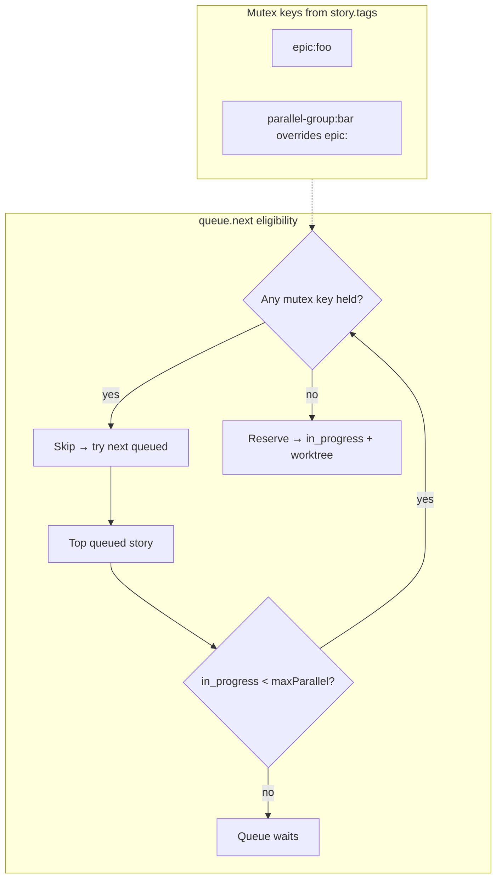

# arc-story-queue — Build Spec (shared understanding)

Derived from `BUILD_PROMPT.md` + handoff, pressure-tested via an interactive grill on 2026-07-07.
This is the decision record the scaffold is built from. **Nothing is built until this is approved.**

---

## 1. Core invariant (the thing everything hangs off)

> **The daemon never runs a model. Fable runs every model. The app is a thin client.**

- **Daemon (MCP server, `:7420`)** owns: queue state, story/run persistence (SQLite), git worktree lifecycle, advisory write-locks, the session registry, SSE fan-out, and JSON-Schema validation at the boundary. It touches git and the filesystem, but never invokes an LLM.
- **Fable (arc-orchestrator, running inside a live Claude Code session)** owns: all model work — intake drafting, `codex-explore` grounding, `arc-planning-work` plans, filing issues, and delegation to composer/codex/opus routes in worktrees. Fable *pulls* work; the daemon never pushes.
- **App (Tauri board)** owns: rendering + user gestures. Every mutation is an MCP call; live terminals come from an SSE subscription. No orchestration logic lives here.

---

## 2. Decisions (grill record)

| # | Question | Decision |
|---|----------|----------|
| 1 | Who drives dispatch? | **Fable pulls; server is passive.** Server never spawns agents. |
| 2 | Multi-client transport? | **One persistent daemon; Streamable HTTP/SSE on :7420.** App + sessions are MCP clients; `story.update` fans out over SSE. |
| 3 | Project discovery? | **Sessions self-register on connect** (repo/path/branch/model/pid). `project.discover` lists connected-but-unattached; `project.attach` promotes. No localhost scanning. |
| 4 | Who runs intake? | **A connected Fable session.** All model work lives in Fable; deterministic fallback covers the no-session case. |
| 5 | Intake mechanism? | **Pull queue** (`intake.next`/`intake.complete`), mirroring the story queue. No dependency on MCP sampling. |
| 6 | v1 scope? | **Walking skeleton end-to-end first**, then fill in the rest. |
| 7 | Acceptance gate? | **Scripted E2E against the real daemon** + `QueueManager` unit tests for the parallelism law. |
| 8 | This session's output? | **This spec, then stop for review.** No code until approved. |

**Unifying model:** two MCP operation classes —
- **Direct state ops** (synchronous, called by app or session): `queue.next`, `story.get/update/plan/complete`, `project.discover/attach`, reorder, move-column.
- **Fable-work requests** (queued, pulled by Fable, result persisted via a tool): intake, file-to-GitHub, plan-generation.

---

## 3. Issues found in the handoff (fix before/at scaffold)

1. **`arc-contracts/schema/story.schema.json` — over-escaped `wid` pattern.** It reads `"^W-\\\\d{6}$"`, which in JSON is the regex `^W-\d{6}$`... wait — it is `\\\\` → string `\\` → regex `\` + `d`, i.e. requires a **literal backslash** then `d{6}`. `"W-000001"` fails validation. Fix to `"^W-\\d{6}$"` (JSON string `\\d` → regex `\d`).
2. **`.mcp.json.example` contradicts the daemon topology (Decision 2).** It launches a per-session stdio child via `npx story-queue-mcp`. Rewrite to a shared HTTP transport entry pointing at the running daemon (`"url": "http://127.0.0.1:7420/mcp"`, `"type": "http"` per the current MCP client config). A session must *connect to* the daemon, not spawn its own.
3. **`server.ts` tool surface is missing the tools the decisions require.** Add: `session.register` (Decision 3), `intake.enqueue` / `intake.next` / `intake.complete` (Decision 5), and a file-to-GitHub work path (`story.file` request + persist). Existing tools stay.
4. **`queue.ts` `repoOf()` is a stub returning `""`.** The project→repo map must be real for `running(projectId)` scoping (Board/Queue/Observability are per-project). Backed by the session registry.
5. **`handoff.schema.json` is strict (`additionalProperties: false`) but `story.schema.json` is loose.** Decide validation strictness per boundary; at minimum validate `Handoff` and `Story` on `story.complete` / ingest. (Contracts define more types — `Plan`, `RunRecord`, `Project`, `Route` — than have schemas; add schemas for anything validated at the MCP boundary.)

---

## 4. Repo strategy

- New repo **`arc-story-queue`**, depends on **`arc-contracts`** (extracted as its own package). **`arc-orchestrator` never depends on the app.**
- Start multi-package via workspaces (`mcp-server`, `app`); promote to a full monorepo only if the contract churns in lockstep with consumers.
- `arc-contracts` published as a local package (workspace/`file:` link for v1; real registry later).

```
arc-story-queue/
  packages/
    arc-contracts/        # extracted: types + JSON Schemas (source of truth for the seam)
  mcp-server/             # the daemon — headless engine, :7420
    server.ts             # MCP tool surface (HTTP/SSE transport)
    queue.ts              # ordering + worktree/lock manager
    registry.ts           # session registry (self-registration)
    store.ts              # SQLite persistence (stories, runs, queue order)
    validate.ts           # JSON-Schema validation at the boundary
    sse.ts                # story.update fan-out
  app/                    # Tauri desktop board (thin client)
  test/
    e2e.skeleton.test.ts  # the acceptance gate
```

---

## 5. Walking skeleton (v1 vertical slice)

Thinnest path that proves the whole topology. In order:

1. **Extract `arc-contracts`** as a package (types + fixed schemas). Delegatable: `codex-explore` to map current refs, then a write worker to move + wire.
2. **Daemon boots on :7420** with Streamable HTTP/SSE transport (`@modelcontextprotocol/sdk`), SQLite store, JSON-Schema validation.
3. **`session.register`** → session appears in registry; `project.discover`/`project.attach` work.
4. **Seed one queued story** → `queue.next` opens a worktree (`git worktree add`), acquires the write lock, marks `in_progress`.
5. **`story.update` stream** → a few terminal lines fan out over SSE to subscribers.
6. **`story.complete`** → story → `review`, PR attached, `RunRecord` persisted, lock released.
7. **Minimal Tauri Board** → one project's 5 columns render and update **live** off the SSE subscription (styled with `tokens.css`, dark liquid-glass — no full design build yet).

**Deferred to post-skeleton (v2):** Queue/Observability/Orchestrator views, drag-and-drop, GitHub import, the full guardrail pipeline (intake → file → plan → dispatch → parallel lanes → structured handoff), agent-backed intake + in-drawer refine, TUI/web clients.

---

## 6. Acceptance gate (Decision 7)

**Scripted E2E against the real daemon** (`test/e2e.skeleton.test.ts`):
boot daemon → open SSE subscription → `session.register` (fake session) → seed one queued story → `queue.next` → assert worktree created + lock held + `in_progress` → push N `story.update` lines, assert they arrive over SSE → `story.complete` → assert `column === "review"`, PR set, `RunRecord` persisted, **lock released**.

**Plus `QueueManager` unit tests (Vitest)** pinning the parallelism law:
read-only routes never lock · writes serialize per worktree (second `acquireWrite` on same worktree fails fast) · separate worktrees parallelize · global `maxParallel` gating in `next()` · per-label mutex groups (`epic:` / `parallel-group:`) skip ineligible stories without stalling the queue.

**Plus** a manual eyeball: the Tauri Board reflects the run live.

---

## 7. Design + constraints (unchanged, carried forward)

- Match `DESIGN_SYSTEM.md` exactly: dark liquid-glass, one blue accent (`#7c9cff`), semantic status + route colors, mono for machine facts, restrained motion. No emoji, no decorative gradients. Use `tokens.css` verbatim.
- Keep handoff JSON + route table conformant to `arc-contracts`; validate at the MCP boundary with the JSON Schemas.
- Guardrail (when built): **drafts cannot enter Queued/In Progress until filed as a real GitHub issue through Fable.**
- Prototype `Story Queue.dc.html` remains the source of truth for layout + interaction when the full app is built.

---

## 8. Open items — resolved against live sources 2026-07-07 (were blocking; now pinned)

- **MCP TS SDK transport API — RESOLVED.** Installed `@modelcontextprotocol/sdk` latest is **1.29.0**. Probed its real exports: server uses **`StreamableHTTPServerTransport`** (`@modelcontextprotocol/sdk/server/streamableHttp`) wired to **`McpServer`** (`.../server/mcp`) via `McpServer.registerTool(...)` + `server.connect(transport)`; client uses **`StreamableHTTPClientTransport`** (`.../client/streamableHttp`). The docs site's "v2 `createMcpHandler`/`toNodeHandler`" is an **unreleased doc branch — NOT in 1.29.0**; do not use it. Use the classic per-session transport pattern (stateful: `sessionIdGenerator` + a `Map<sessionId, transport>`, endpoint `/mcp` handling POST/GET/DELETE). Pin `@modelcontextprotocol/sdk@^1.29`.
- **Claude Code HTTP-MCP config — RESOLVED.** `.mcp.json` entry is `{ "type": "http", "url": "http://127.0.0.1:7420/mcp" }` (`streamable-http` is an accepted alias for `http`; a `url` with no `type` is a hard config error CC rejects). Add via `claude mcp add --transport http story-queue http://127.0.0.1:7420/mcp`.
- **SQLite driver — RESOLVED.** Use the **`node:sqlite`** builtin (available on the Node 25.6.1 here; emits an experimental warning — acceptable for v1). No native `better-sqlite3` dependency.

### Lifecycle & parallelism — current behavior (post W-000027–W-000031)

- **Worktree cleanup policy** — retain on `story.complete` (worktree holds the PR branch until review); remove on `story.merge`, on merged-PR reconcile (`reconcileReviewPrs`), and on issue-close purge (`reconcileInProgressIssues`, covering GitHub-backed Backlog, Queued, and In Progress stories); remove on explicit `story.abandon`; **preserve** on closed-unmerged PR eviction to Backlog (worktree kept for recovery).
- **Parallelism** — global cap `maxParallel` (default 2, `config.get` / `config.set` `{ autoRun, maxParallel }`) limits concurrent `in_progress` stories. Per-label mutex groups add a second constraint: `epic:<name>` and `parallel-group:<name>` labels on `story.tags` (from GitHub issue labels) define mutex keys; `parallel-group:` overrides `epic:` when both are present. `queue.next` skips ineligible stories and dispatches the next eligible one — the queue does not stall. Block reason: `waiting · <key> in progress`.
- **GitHub reconcile timer** — one shared daemon timer (`prReconcileIntervalMs`, default 60_000 ms; `0` disables; programmatic `DaemonOptions` field only — no CLI flag or env var). Every tick runs both `reconcileReviewPrs()` and `reconcileInProgressIssues()` in `QueueManager`; closed GitHub-backed issues in Backlog, Queued, or In Progress are purged and queued entries are removed from queue eligibility.

### Parallelism: global cap vs label mutex groups



Global `maxParallel` is a hard ceiling on concurrent in_progress stories. Label mutex groups are an additional per-key constraint on top — a story can be under the global cap but still skipped because its `epic:` or `parallel-group:` key is busy.

---

*Next step on approval:* delegate the walking-skeleton tasks (§5) to workers — `codex-explore` for the contracts extraction map, `composer-implement` for the daemon + Tauri scaffold — gated by the §6 E2E test. Nothing runs until you say go.
