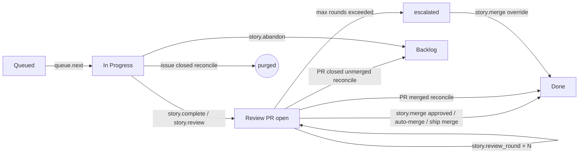

# Story Queue — build handoff

An orchestration board that queues **stories** and feeds them to live **Claude Code** sessions over MCP, where **Fable** (arc-orchestrator) delegates bounded tasks to worker routes (composer / codex / opus) in isolated git worktrees.

## Repo strategy (recommended)

Three logical packages, dependency arrow points **toward** the orchestrator — the orchestrator never depends on the app.

| Package | What it is | Depends on |
|---|---|---|
| `arc-orchestrator` | Existing Claude Code plugin (delegation, routes, lock rules) | — |
| `arc-story-queue/packages/arc-contracts` | Shared schema: handoff, routes, story, run record | — |
| `arc-story-queue` | MCP server + Vite web app (this prototype) | `arc-contracts` workspace package |

The `arc-contracts` workspace package under `arc-story-queue/packages/` is the single source of truth for shared types and JSON Schemas. The historical root-level handoff copy has been removed to avoid schema drift. Never make `arc-orchestrator` depend on the app.

## Form factor

Build the **engine as a headless local service** (MCP server + worktree/lock manager + session discovery). The Kanban is one client of it:

- **Web (primary v1)** — React + Vite app; full board, drawers, live worker terminals, observability.
- **Desktop (deferred v2)** — Tauri shell for local filesystem integrations around git worktrees + spawning agents.
- **TUI (secondary)** — in-terminal "what's running / dispatch next / tail a run".

## What's in this handoff

- `DESIGN_SYSTEM.md` + `tokens.css` + `tokens.json` — the visual language of the prototype.
- `arc-story-queue/packages/arc-contracts/` — TypeScript types + JSON Schemas for the shared seam.
- `arc-story-queue/` — npm workspace containing the MCP server, queue/worktree/lock manager, and Vite app.
- `BUILD_PROMPT.md` — paste into Claude Code to scaffold the project.

The working UI prototype (`Story Queue.dc.html`) is the source of truth for layout and interaction.

**Living docs** (post-ship behavior, GitHub reconcile, concurrency): `arc-story-queue/README.md` and `docs/INTEGRATION.md`. Decision record: `BUILD_SPEC.md`.

## Story lifecycle

Columns: **Backlog** → **Queued** → **In Progress** → **Review** → **Done**. After a worker handoff (`story.complete`) or board send (`story.review`), the story lands in **Review** with an open PR and an initialized review loop (`round: 0`, `maxRounds: 3`, `verdict: pending`). Fable runs up to `maxRounds` of `story.review_round` (blocking fixes between rounds); an **approved** round sets `annotation = accepted` and unlocks `story.merge` (squash). In **`auto`** ship mode the daemon additionally arms squash auto-merge on approval (`story.merge` stays available as a fallback). **`merge`** ship mode skips the loop and squash-merges immediately after PR creation. See `docs/INTEGRATION.md` for ship-mode and gate details.

