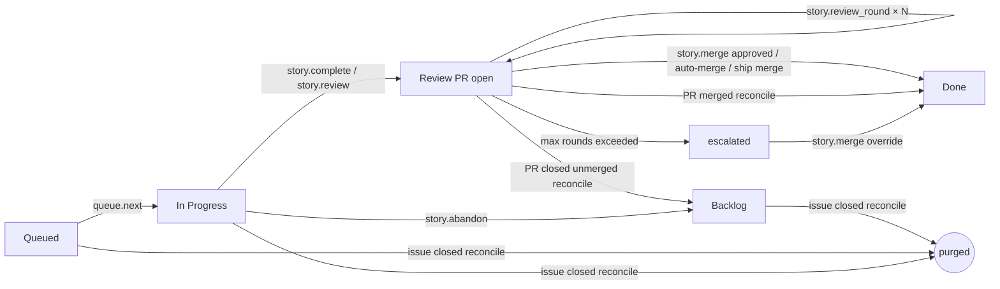

# Integration smoke test

This guide gets the local story-queue daemon, the board UI, and one live Fable / Claude Code session connected end-to-end. The expected MCP endpoint is:

```text
http://127.0.0.1:7420/mcp
```

## Prerequisites

- Node.js with the experimental `node:sqlite` module available.
- An authenticated GitHub CLI if you plan to import real issues: `gh auth status`.
- Claude Code with the arc-orchestrator plugin available in the session that will act as Fable.
- A real repository path to attach as the project; use an absolute path in the commands below.

Run the one-time install and build from the repository root:

```bash
cd /absolute/path/to/arc-board/arc-story-queue
npm install
npm run build
```

## Terminal 1: start the daemon

```bash
cd /absolute/path/to/arc-board/arc-story-queue
npm run daemon
```

Success looks like:

```text
arc-story-queue daemon listening on http://127.0.0.1:7420/mcp
```

Keep this terminal running. The daemon owns queue state, worktrees, locks, SSE fan-out, handoffs, and run records. It does not run a model.

## Terminal 2: start the board UI

```bash
cd /absolute/path/to/arc-board/arc-story-queue/app
npm run dev
```

Open the Vite URL printed by the command, usually `http://localhost:5173`.

Expected board state:

1. The titlebar connection pill changes from `Offline` to a connected state.
2. The Orchestrator view shows `Connected` and `http://127.0.0.1:7420/mcp`.
3. After a project is attached by the Fable session, Board, Queue, and Observability scope to that project.

## Terminal 3: start Claude Code / Fable

Configure the shared HTTP MCP server before starting or restarting Claude Code:

```bash
claude mcp add --transport http story-queue http://127.0.0.1:7420/mcp
```

Equivalent `.mcp.json`:

```json
{
  "mcpServers": {
    "story-queue": {
      "type": "http",
      "url": "http://127.0.0.1:7420/mcp"
    }
  }
}
```

Start Claude Code from the repository that should become the attached project, with the arc-orchestrator plugin enabled. Load the story-queue session skill (currently stored in this repo as `arc-story-queue/skills/fable-pull-loop/SKILL.md`) and run the helper:

```bash
cd /absolute/path/to/arc-board/arc-story-queue
npm run fable:pull -- --path /absolute/path/to/project-repo --model "<current-claude-model-id>"
```

The helper performs the required MCP calls in order:

1. `session.register` for the live Claude Code session.
2. `project.attach` for the project repo.
3. `queue.next` to reserve the next **eligible** queued story (respects global `maxParallel` and `epic:` / `parallel-group:` label mutex groups) and open its worktree.
4. `story.update` to emit the first live terminal line over SSE.

Then follow the assignment prompt printed by the helper. During implementation, stream progress and completion back to the daemon:

```bash
npm run fable:update -- --id <story-id> --route fable --kind out --line "Starting implementation" --lane-status running
npm run fable:update -- --id <story-id> --route fable --kind ok --line "Opened pull request" --lane-status done
npm run fable:complete -- \
  --id <story-id> \
  --pr https://github.com/owner/repo/pull/123 \
  --handoff /tmp/handoff.json \
  --runs /tmp/runs.json \
  --outcome accepted
```

## Ship modes & the PR review loop

After `story.complete` or `story.review` opens a PR, **ship mode** controls whether the review loop runs and how merge is triggered. Set `ship` on `story.review` (or persist `shipMode` on the story); default is `pr`.

| Mode | Behavior |
|---|---|
| **`pr`** (default) | Opens the PR and runs the full review loop. Fable records rounds with `story.review_round`, then calls `story.merge` after an approved round. |
| **`auto`** | Same loop as `pr`. When a round is recorded with `verdict: approved`, the daemon arms squash auto-merge on GitHub (`gh pr merge --auto --squash --delete-branch`). `story.merge` remains available if arming fails. |
| **`merge`** | Squash-merges immediately after PR creation (`story.review` / `story.complete` with `ship: merge`). No review loop and no `story.review_round` path. PR readiness checks and merge remediation still apply. |

### Review loop substate

`story.review` and `story.complete` initialize `reviewLoop` when landing in Review (except `merge` mode, which goes straight to Done):

```json
{ "round": 0, "maxRounds": 3, "verdict": "pending", "blockingCount": 0 }
```

`maxRounds` defaults to **3** (override via `story.review { maxRounds }`). Fields on each round:

- **`round`** — incremented by `story.review_round` (starts at 0 before the first round).
- **`maxRounds`** — cap on `changes_requested` rounds before escalation.
- **`verdict`** — `pending`, `changes_requested`, or `approved`.
- **`blockingCount`** — blocking findings for the round.
- **`prCommentsUrl`** — optional link to the PR review thread.

**No acceptance at PR-open.** `story.review` / `story.complete` do not set `annotation = accepted` when the PR opens. An approved review round sets `annotation = accepted`. The contract rejects `verdict: approved` unless `blockingCount === 0`.

### `story.review_round` tool

Registered on the daemon MCP surface (`story.review_round`):

| Input | Type | Notes |
|---|---|---|
| `id` | string | Story id |
| `verdict` | `changes_requested` \| `approved` | Required |
| `blockingCount` | non-negative integer | Required; must be `0` when `approved` |
| `prCommentsUrl` | string | Optional |

Requires the story in **Review** with `prState: open`. Each call increments `round` and persists the verdict.

When `round` has already reached `maxRounds` and the next call would record `changes_requested`, the daemon throws a structured **`max_rounds_exceeded`** error (`MaxRoundsExceeded` in the pull-loop skill), sets `annotation = escalated`, and suggests:

- `story.merge { override: true }`, or
- move the story back to **In Progress** for a larger fix.

On `verdict: approved`, the daemon sets `annotation = accepted` and, in **`auto`** mode only, arms squash auto-merge (best-effort).

### `story.merge` gate

`story.merge` requires Review with an open PR. Unless `override: true`, `reviewLoop.verdict` must be **`approved`**; otherwise the daemon returns **`review_pending`**.

- **`override: true`** bypasses the app-level verdict gate and sets `annotation = escalated` when the verdict was not approved.
- All daemon merges use **squash** (`gh pr merge --squash --delete-branch`).

### Gate authority

The daemon's **`reviewLoop.verdict` gate** is the authoritative **application-level** merge gate. **GitHub branch protection** (required reviews, status checks, etc.) is an independent backstop; the daemon never relaxes branch protection. `override: true` bypasses only the app-level gate, not GitHub's.

## Queue one story

Use one of these paths before running `fable:pull`:

- In the board, click `+ New Story`, file/import the story, then move it to `Queued`.
- Or import open GitHub issues, then enqueue one in the board:

```bash
cd /absolute/path/to/arc-board/arc-story-queue
npm run import -- owner/repo
```

Imported issues land in Backlog as filed, non-draft stories. Drag one to Queued, or use the card enqueue action.

## GitHub reconcile (periodic)

The daemon runs a **shared reconcile timer** on every tick (`prReconcileIntervalMs`, default 60_000 ms; `0` disables). Each tick executes both `reconcileReviewPrs()` and `reconcileInProgressIssues()` inside `QueueManager` — these are internal methods, not MCP tools.

### Review PR reconcile

For stories in **Review** with a real GitHub PR (`prState: open`):

| GitHub PR state | Board outcome | Worktree |
|---|---|---|
| **Merged** | Story → **Done**, `prState: merged`, SSE `done` | Removed |
| **Closed** (unmerged) | Story → **Backlog**, PR cleared, `prState: closed`, annotation `escalated`, SSE `escalated` | **Preserved** (recovery banner in drawer) |

`local://` sentinel PRs are excluded. Review does not hold closed PRs indefinitely.

### Backlog/queued/in-progress issue reconcile (issue-close purge)

For non-draft stories in **Backlog**, **Queued**, or **In Progress** with a linked GitHub issue (real repo, not `local/...`):

| GitHub issue state | Board outcome | Worktree |
|---|---|---|
| **CLOSED** | Story **deleted** entirely (`dequeue` + `deleteStory`), removed from queue eligibility, write lock released if held, SSE `purged` | Removed when present |

Closed GitHub issues delete the story; closed unmerged PRs evict to Backlog. That asymmetry is intentional.

### Label-based dispatch concurrency

Mutex keys come from `story.tags` (GitHub issue labels):

- `epic:<name>` — epic mutex group
- `parallel-group:<name>` — parallel mutex group; when present, **overrides** `epic:` labels as the mutex key

`queue.next` dispatches only when `in_progress` count < global `maxParallel` (default 2, via `config.get` / `config.set`) **and** none of the story's mutex keys is held by an in_progress story. Ineligible stories are **skipped** — the next eligible story dispatches. Block reason: `waiting · <key> in progress`.

### Lifecycle diagram



Side paths run on the shared reconcile timer (default every 60s) via `gh issue view` and `gh pr view`.

### Verify board ↔ GitHub fidelity

Run these from the project repo while the daemon is up:

**Issue state vs Backlog / Queued / In Progress (purge path):**

```bash
gh issue view <n> --json state,title
```

If `state` is `CLOSED` but the story is still in Backlog, Queued, or In Progress, wait for the next reconcile tick (or check `prReconcileIntervalMs` is not `0`). After reconcile, the story should be gone; queued stories are removed from queue eligibility and in-progress worktrees are removed.

**PR state vs Review column:**

```bash
gh pr view <branch-or-number> --json state,mergedAt,title
```

| `state` | `mergedAt` | Expected column |
|---|---|---|
| `OPEN` | — | Review |
| `MERGED` | set | Done (worktree removed) |
| `CLOSED` | null | Backlog (worktree preserved, recovery banner) |

**Dispatch eligibility (label mutex):**

```bash
gh issue view <n> --json labels
```

Stories sharing an `epic:` or `parallel-group:` label with an in_progress story should stay in Queued with block reason `waiting · <key> in progress` until the holder finishes or is purged.

## Success checklist

The smoke test is passing when all of these are true:

- Daemon is running at `http://127.0.0.1:7420/mcp`.
- Board UI shows a connected state and the attached project repo.
- Fable pulls one queued story through `queue.next`.
- The story card moves to In Progress while Fable works.
- Live terminal lines from `story.update` appear in the board over SSE.
- Fable calls `story.complete` with a strict handoff and run records.
- The story lands in Review with the PR URL and persisted handoff visible in the drawer.
- Observability shows the run record with its outcome.

## Troubleshooting

### Daemon offline

Symptoms:

- Board titlebar says `Offline`.
- Orchestrator view says `Offline`.
- Claude Code or `fable:pull` cannot connect to `127.0.0.1:7420`.

Fix:

```bash
cd /absolute/path/to/arc-board/arc-story-queue
npm run build
npm run daemon
```

If port `7420` is already in use, stop the stale daemon process and restart. Keep Terminal 1 open for the entire smoke test.

### MCP misconfigured

Symptoms:

- Claude Code does not list a `story-queue` MCP server.
- Tool calls fail before `session.register`.
- The board is connected, but the Fable session never appears as an attachable project.

Fix:

```bash
claude mcp add --transport http story-queue http://127.0.0.1:7420/mcp
```

Then restart Claude Code. The server must be configured as HTTP with this exact URL:

```json
{ "type": "http", "url": "http://127.0.0.1:7420/mcp" }
```

Do not configure this as a per-session stdio server; all clients connect to the shared daemon.

### Session not registered

Symptoms:

- Board connects to the daemon but shows no attached project.
- Board, Queue, or Observability says `No project attached`.
- `fable:pull` cannot reserve work for the expected repo.

Fix:

Run the pull helper from Terminal 3 with an absolute project path:

```bash
cd /absolute/path/to/arc-board/arc-story-queue
npm run fable:pull -- --path /absolute/path/to/project-repo --model "<current-claude-model-id>"
```

This registers the session and attaches the project. If you are not using the helper, call `session.register`, then `project.attach`, then `queue.next` through the `story-queue` MCP server in that order.
